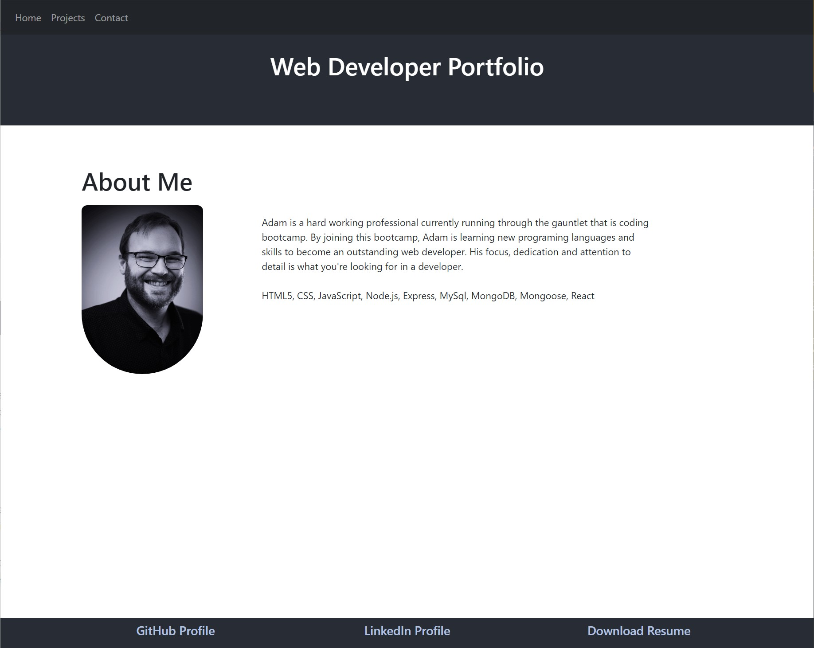

  
  # React Portfolio

  ## Description
  A collection of projects to demostrate my abilities as a web developer
  
  ## License Badge
  
  []
  
  ## Table of Contents
  
  - [Installation](#installation)
  - [Usage](#usage)
  - [ScreenShot](#screenshot)
  - [Git Hub Repo](#git-hub-repo)
  - [Live Site](#live-site)
  - [License](#license)
  
  ## Installation
  
  No steps to install, just preview the page and projects in your web browser!
  
  ## Usage
  
  In the web browser
  
  ## ScreenShot
  
  
  ## Git Hub Repo
  https://github.com/adamnatrop/react_portfolio

  ## Live Site
  https://adamnatrop.github.io/react_portfolio/

  
  ## License
  
  The Unlicense
  Review License terms at [http://unlicense.org/](http://unlicense.org/)
  
  
  
  ## Questions
  Check out my Github for more information
  
  [adamnatrop](https://www.github.com/adamnatrop)
  
  Or email me with any questions or issues.

  [adamnatrop@gmail.com](adamnatrop@gmail.com)

  